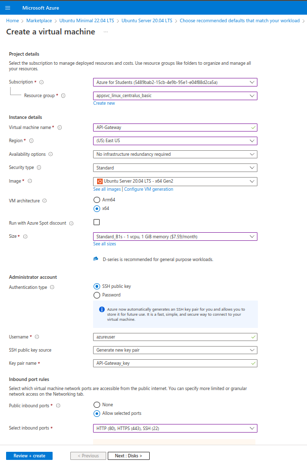
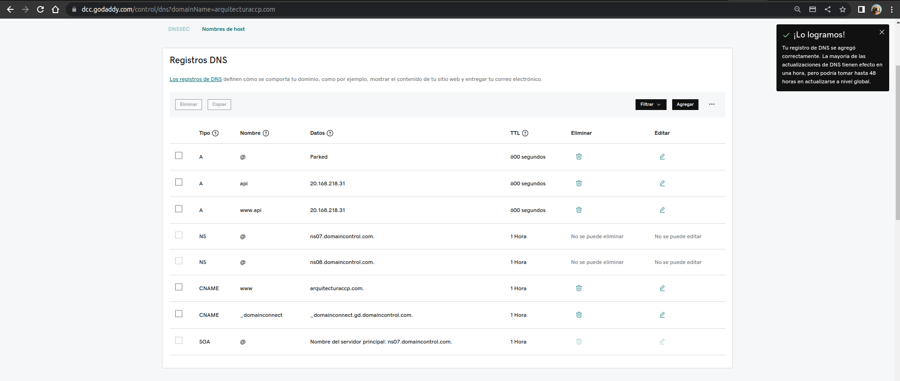

# Configuración de nginx como API-Gateway

## Máquina virtual utilizada



## Configuracion de los DNS Records del dominio del experimento



## Configuracion de nginx para redireccionar el trafico

```bash
# Instalar nginx y certbot
sudo apt install nginx
sudo snap install certbot --classic

# 1) Es importante que el dominio a certificar apunte a la maquina que esta creando el certificado.
# 2) El puerto 80 debe estar permitido por firewall
# 3) Esta operacion es interactiva.
sudo certbot --nginx -d 'api.arquitecturaccp.com' -d 'www.api.arquitecturaccp.com'

sudo vim /etc/nginx/sites-available/default
```

---

```nginx
# /etc/nginx/sites-available/default
server {

    root /var/www/html;

    # Add index.php to the list if you are using PHP
    index index.html index.htm index.nginx-debian.html;
    server_name api.arquitecturaccp.com www.api.arquitecturaccp.com; # managed by Certbot

    location / {
        location /ordencompra {
            proxy_pass https://app-service-cpp-001.azurewebsites.net/ordencompra;
        }

        location /transporte {
            proxy_pass https://app-service-ccp-002.azurewebsites.net/transporte;
        }

        #location /consultaruta/ {
        #    proxy_pass https://app-service-ccp-003.azurewebsites.net/consultaruta;
        #}

        location /estadoordencompra {
            proxy_pass https://app-service-cpp-003.azurewebsites.net/estadoordencompra:
        }
        # First attempt to serve request as file, then
        # as directory, then fall back to displaying a 404.
        try_files $uri $uri/ =404;
    }

    listen [::]:443 ssl ipv6only=on; # managed by Certbot
    listen 443 ssl; # managed by Certbot
    ssl_certificate /etc/letsencrypt/live/api.arquitecturaccp.com/fullchain.pem; # managed by Certbot
    ssl_certificate_key /etc/letsencrypt/live/api.arquitecturaccp.com/privkey.pem; # managed by Certbot
    include /etc/letsencrypt/options-ssl-nginx.conf; # managed by Certbot
    ssl_dhparam /etc/letsencrypt/ssl-dhparams.pem; # managed by Certbot
}

server {
    if ($host = www.api.arquitecturaccp.com) {
        return 301 https://$host$request_uri;
    } # managed by Certbot


    if ($host = api.arquitecturaccp.com) {
        return 301 https://$host$request_uri;
    } # managed by Certbot


    listen 80 ;
    listen [::]:80 ;
    server_name api.arquitecturaccp.com www.api.arquitecturaccp.com;
    return 404; # managed by Certbot
}

```

---

```bash
sudo systemctl restart nginx
```
